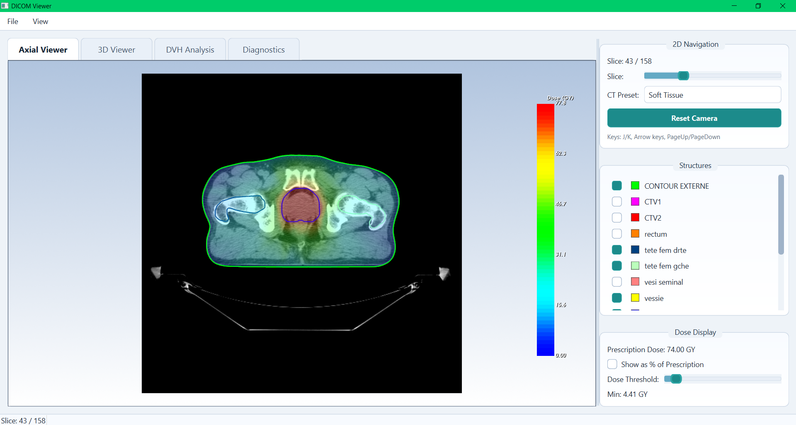
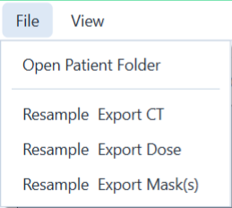
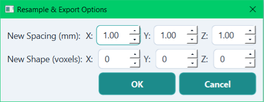
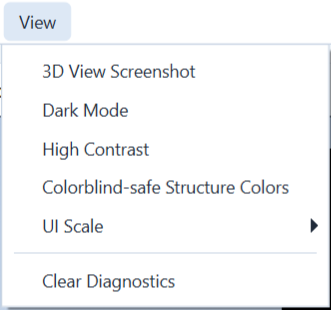
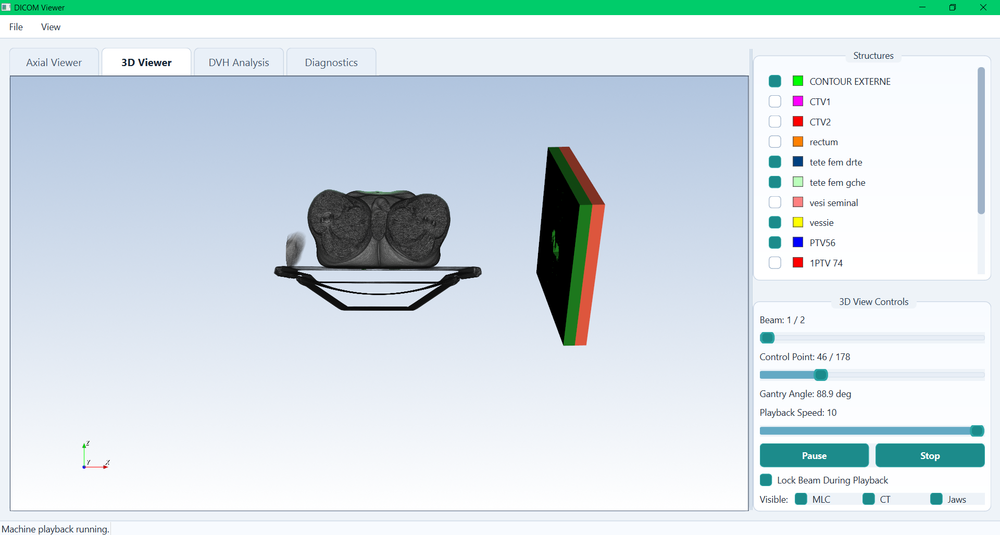
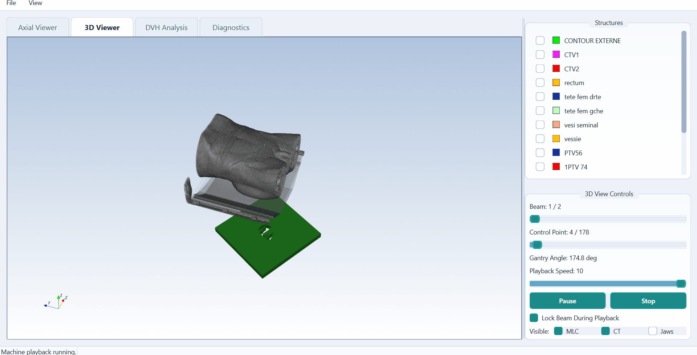
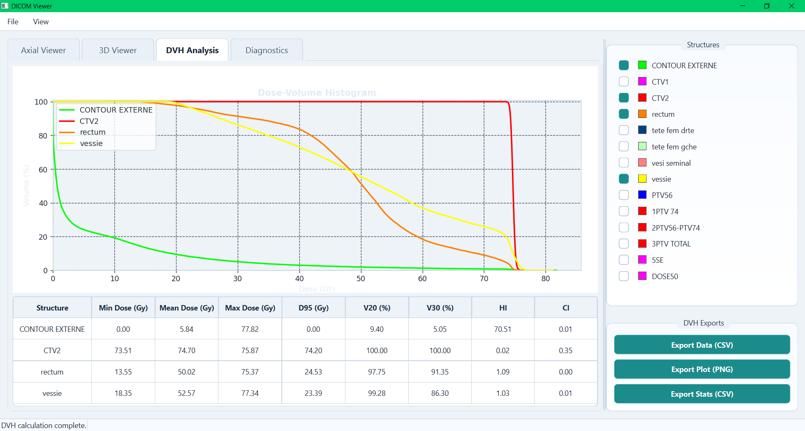
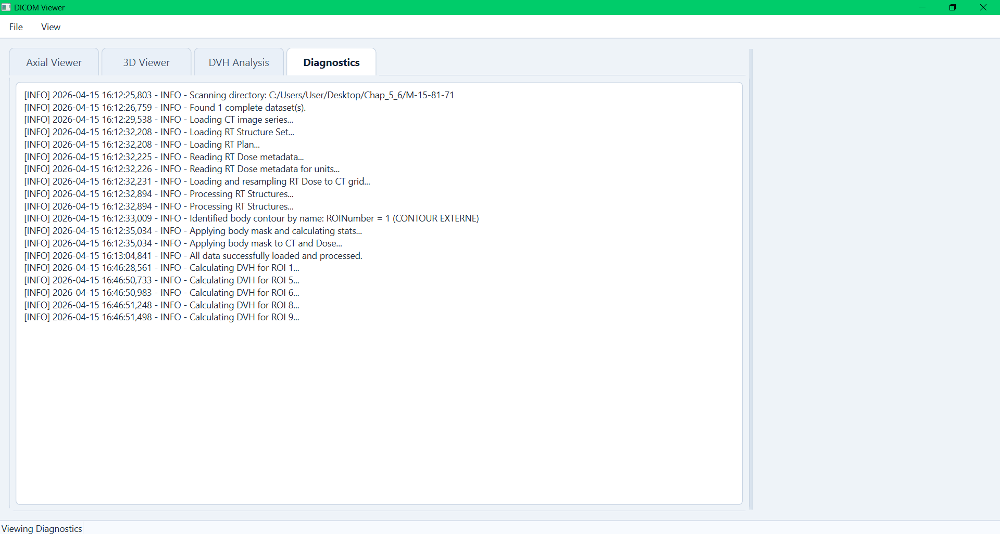

<p align="center"></p>

# CURATOR: A DICOM RT Viewer (PyQt6 + VTK)

A research-oriented desktop interface for radiotherapy DICOM review and analysis:
- 2D axial CT + RTDOSE overlay + RTSTRUCT contours
- 3D CT volume + structure surfaces + RTPLAN machine playback
- Dose-Volume Histogram (DVH) plotting and export
- Dataset integrity checks for CT -> RTSTRUCT -> RTPLAN -> RTDOSE chains

This application is designed for reproducible visualization workflows in medical imaging / radiotherapy research environments.



## Table of Contents

- [1. Key Features](#1-key-features)
- [2. Architecture](#2-architecture)
- [3. Requirements](#3-requirements)
- [4. Run](#4-run)
- [5. Batch / Headless Dataset Curation](#5-batch--headless-dataset-curation)
- [6. Interactive Selection, Menus and Controls](#6-interactive-selection-menus-and-controls)
- [7. Advanced Configuration](#7-advanced-configuration)
- [8. Typical Workflow](#8-typical-workflow)
- [9. Data Expectations](#9-data-expectations)
- [10. Performance Notes](#10-performance-notes)
- [11. Validation / Quality Controls](#11-validation--quality-controls)
- [12. Troubleshooting](#12-troubleshooting)
- [13. Limitations](#13-limitations)
- [14. Citation](#14-citation)

## 1. Key Features

- Structured DICOM discovery and linkage (`CT`, `RTSTRUCT`, `RTPLAN`, `RTDOSE`)
- Interactive 2D axial navigation with CT window/level presets (`Auto`, `Soft Tissue`, `Lung`, `Bone`)
- Dose thresholding with Gy / % prescription display modes
- 3D machine animation across beams and control points
- Dynamic-beam focused machine controls (setup beams filtered where applicable)
- Multi-ROI DVH plotting with interactive hover annotations
- Export:
  - DVH curves (`CSV`)
  - DVH plot (`PNG`)
  - DVH statistics table (`CSV`)
  - 3D screenshot (`PNG`)
  - Resampled CT / dose / masks (`NIfTI`)
- Integrated diagnostics panel (in-app logging stream)

## 2. Architecture

The codebase follows an MVC-style separation:

- `model.py`: DICOM loading, resampling, structure parsing, masks, DVH math
- `view.py`: Qt UI composition, signal surface, widget state updates
- `controller.py`: orchestration, signal wiring, interaction logic, exports
- `vtk_controller.py`: 2D VTK scene and slice interactor logic
- `vtk_controller_3d.py`: 3D VTK scene and machine geometry playback
- `dicom_organizer.py`: folder scanning and treatment-chain linkage
- `widgets.py`: dialogs and custom plotting widgets
- `styles.py`: centralized dark/light visual system
- `config.py`: configurable constants for visualization and behavior

Repository layout (all core modules sit at the repository root):

```
CURATOR/
├── main.py
├── model.py
├── view.py
├── controller.py
├── vtk_controller.py
├── vtk_controller_3d.py
├── dicom_organizer.py
├── widgets.py
├── styles.py
├── config.py
├── requirements.txt
├── LICENSE
├── README.md
├── CURATOR_icon.png
└── tools/
    └── headless_dataset_curation.py
```

## 3. Requirements

Python `3.8+` is recommended.

Install dependencies from the repository root (where `requirements.txt` exists):

```bash
pip install -r requirements.txt
```

Main libraries:
- `PyQt6`
- `vtk`
- `SimpleITK`
- `pydicom`
- `numpy`
- `matplotlib`
- `scikit-image`

## 4. Run

From the repository root:

```bash
python main.py
```

## 5. Batch / Headless Dataset Curation

For cohort-scale processing, `headless_dataset_curation.py` runs the same underlying `DICOMDataModel` pipeline without the GUI, on every patient folder found under a root directory.

```bash
python tools/headless_dataset_curation.py \
  --raw-data-root "/path/to/Raw_DICOM_Database" \
  --output-root "/path/to/Curated_NIfTI_Dataset" \
  --spacing 1,1,1 --shape 128,128,64 \
  --structures PTV Rectum Bladder Femur_L Femur_R
```

### Arguments

| Flag | Default | Description |
|---|---|---|
| `--raw-data-root` | *required* | Folder containing one subfolder per patient. |
| `--output-root` | *required* | Destination for exported NIfTI files and reports. |
| `--spacing` | `1,1,1` | Target voxel spacing in mm, as `x,y,z`. |
| `--shape` | `128,128,64` | Target array shape in voxels, as `x,y,z`. |
| `--structures` | `PTV Rectum Bladder Femur_L Femur_R` | ROI name patterns to export as masks. Matching is case-insensitive and alphanumeric-normalized (`Femur_L`, `femur l`, and `LFemur` all match), with a small built-in alias table also matching `Bladder`↔`Vesica`/`UrinaryBladder`, `Rectum`↔`Rectal`, `Femur_L`/`Femur_R`↔`FemoralHead L`/`R`, and `PTV`↔`PTVBoost`/`PTVHigh`/`PTVLow`. |
| `--include-root` | off | Also treat `--raw-data-root` itself as a single patient folder (for single-case runs). |
| `--log-level` | `INFO` | `DEBUG` / `INFO` / `WARNING` / `ERROR`. |

### Per-Patient Handling

Each immediate subfolder of `--raw-data-root` is treated as one patient:

- All complete CT → RTSTRUCT → RTPLAN → RTDOSE chains in the folder are enumerated. A folder with zero complete chains is rejected (`REJECTED_INTEGRITY`) without stopping the rest of the batch.
- If more than one complete chain exists (a re-plan, a duplicated export, a separate QA plan), one is selected **deterministically** — never arbitrarily, and without prompting — by ranking candidates on RTDOSE summation type (`PLAN` > `BEAM` > `FRACTION` > `MULTI_PLAN` > `BRACHY` > `CONTROL_POINT`), then breaking ties on CT/RTSTRUCT/RTPLAN/RTDOSE identifiers. The same chain is selected on every run. This is the headless counterpart to the interactive chain-selection dialog described in [Section 6](#6-interactive-selection-menus-and-controls) — no dialog is shown, but the result is reproducible.
- The selected chain is loaded and exported: resampled CT (`{ID}_CT.nii.gz`), resampled dose (`{ID}_Dose.nii.gz`), and one mask per matched structure (`{ID}_Mask_{name}.nii.gz`), into `{output-root}/{ID}/`.
- Requested structure patterns with no match in a given case are logged as a warning and listed per-case in the manifest — this does **not** fail the case.
- If export fails partway, any partial CT/dose files for that case are deleted rather than left inconsistent, and the case is marked `ERROR_EXPORT`.

### Outputs

Written to `--output-root`:

- **`curation_log.txt`** — full timestamped run log.
- **`dataset_manifest.csv`** — one row per patient: `Status` (`SUCCESS` / `REJECTED_INTEGRITY` / `ERROR_LOAD` / `ERROR_EXPORT`), `Reason`, `ChainCandidates` (complete chains found before selection), the selected chain's identifiers, matched vs. missing requested structures, and the output folder.
- **`curation_summary.csv`** — aggregate counts (`Total`, `Success`, `Fail_Integrity`, `Fail_Load`, `Fail_Export`) plus the run's spacing/shape/structure settings, suitable for citing directly in a methods section.

Exit code is `0` if every patient produced a successful export, `1` if any were rejected or errored — suitable for CI/scripted use.

## 6. Interactive Selection, Menus and Controls

This section documents the interactive controls available during a normal (non-headless) session.

### Interactive Chain Selection

When `File → Open Patient Folder` finds more than one complete CT → RTSTRUCT → RTPLAN → RTDOSE chain in the selected folder, a selection dialog lists every candidate chain in a browsable tree, with dose summation type and dataset identifiers shown per row so you can choose which one to load. Selection here is manual: unlike the [headless tool](#5-batch--headless-dataset-curation), which automatically ranks candidates by `PLAN` > `BEAM` > `FRACTION` > `MULTI_PLAN` > `BRACHY` > `CONTROL_POINT`, the interactive dialog does not pre-select or default to any candidate. The summation type is shown per row precisely so you can apply that same ranking by eye if you want your interactive choice to match what the headless tool would select — but the tree itself leaves the decision entirely to you.

### File Menu



- **Open Patient Folder** — starts dataset discovery and, if needed, the chain-selection dialog described above.
- **Resample & Export CT** / **Resample & Export Dose** / **Resample & Export Mask(s)** — three separate top-level File-menu items (not a submenu); each opens the **Resample & Export Options** dialog below, letting you set a target voxel spacing and/or output shape before writing a NIfTI file.



Leaving **New Shape (voxels)** at `0, 0, 0` exports at the resampled spacing without cropping or padding to a fixed array size.

### View Menu



- **3D View Screenshot** — saves the current 3D render as a PNG.
- **Dark Mode / High Contrast / Colorblind-safe Structure Colors** — display presets; colorblind-safe mode remaps structure colors to a palette distinguishable under common color-vision deficiencies.
- **UI Scale** — a manual 100% / 110% / 125% font-size preference for the interface, not automatic DPI detection; useful for improving readability on high-DPI displays.
- **Clear Diagnostics** — clears the log stream shown in the Diagnostics tab.

## 7. Advanced Configuration

Structure contours are rasterized into 3D masks using a `legacy` (NumPy/scikit-image)
backend by default. An alternate `vtk` backend is also available and can be selected
without changing code:

```bash
# Windows
set DICOM_MASK_BACKEND=vtk
python main.py

# macOS / Linux
DICOM_MASK_BACKEND=vtk python main.py
```

An invalid value falls back to `legacy` with a logged warning. This setting affects
DVH/CI calculation, mask export, body-based dose masking, and 3D structure surfaces —
all of which are built from the voxelized mask. It does not affect the 2D contour
outlines in the Axial Viewer, which are drawn directly from the RTSTRUCT contour
points rather than from the mask.

## 8. Typical Workflow

1. `File → Open Patient Folder`
2. Review the compatibility summary dialog
3. If multiple chains were found, resolve the [interactive chain-selection dialog](#6-interactive-selection-menus-and-controls); otherwise the single complete chain loads automatically
4. Inspect each tab:

**Axial Viewer** — CT, dose color-wash, and structure contours, with 2D slice navigation and CT preset controls.


**3D Viewer** — structure surfaces and beam/machine geometry, with playback across beams and control points.





**DVH Analysis** — multi-ROI dose-volume histograms with per-structure statistics (min/mean/max dose, D95, V20, V30, HI, CI) and CSV/PNG export.



**Diagnostics** — in-app log stream for load and processing steps, useful for QA and troubleshooting.



5. Export required outputs via `File → Resample & Export CT / Dose / Mask(s)`, or the DVH tab's **Export Data / Plot / Stats** buttons.

## 9. Data Expectations

The interface expects a linkable chain:

`CT Series -> RTSTRUCT -> RTPLAN -> RTDOSE`

If multiple chains exist, selection is explicit through the dialog described in [Section 6](#6-interactive-selection-menus-and-controls). This mirrors the same completeness check used by the [headless curation tool](#5-batch--headless-dataset-curation): a patient folder with zero complete chains is rejected rather than partially loaded.

## 10. Performance Notes

- Body contour detection uses a fast name-first strategy with geometric fallback.
- 3D structure meshes are created lazily (on demand), reducing initial load time.
- DVH calculations are cached by ROI to avoid redundant recomputation.
- Machine actors are cached by `(beam, control point)` state.

## 11. Validation / Quality Controls

- Dataset compatibility is checked before loading.
- Dose is resampled to CT grid with non-negative clamping.
- Body masking is applied to dose; CT display remains unmasked for robust visualization.
- DVH export aligns heterogeneous DVH arrays onto a common dose axis to avoid index errors.

## 12. Troubleshooting

### CT appears mostly black in 2D
- Use `CT Preset -> Auto` (default on load).
- Navigate to a central informative slice.

### Blue low-dose wash dominates the 2D view
- Increase `Dose Threshold` slider.
- Verify you selected the intended RTDOSE dataset.
- Check dose noise-floor constants in `config.py`.

### DVH export error
- Use latest code (DVH export now handles unequal curve lengths).
- Ensure at least one valid DVH structure is selected.

### Slow loading on large cohorts
- Keep diagnostics tab open to inspect step timing.
- Prefer complete, modality-clean patient folders.

## 13. Limitations

- Intended for research/engineering workflows, not certified clinical use.
- RTPLAN machine geometry assumes common DICOM RT conventions; vendor-specific edge cases may require adaptation.
- Extremely heterogeneous multi-series folders can still require manual dataset selection.

## 14. Citation

If this software supports a manuscript or is used in published work, please cite it. 

```bibtex
@software{curator_dicom_viewer,
  author  = {<Bellahsaouia Meryeme, Zidouh Ibtissam, Chakir Elmahjoub>},
  title   = {CURATOR: A DICOM RT Viewer},
  year    = {2026},
  url     = {<https://github.com/meryemebellahsaouia-alt/CURATOR>},
}
```
